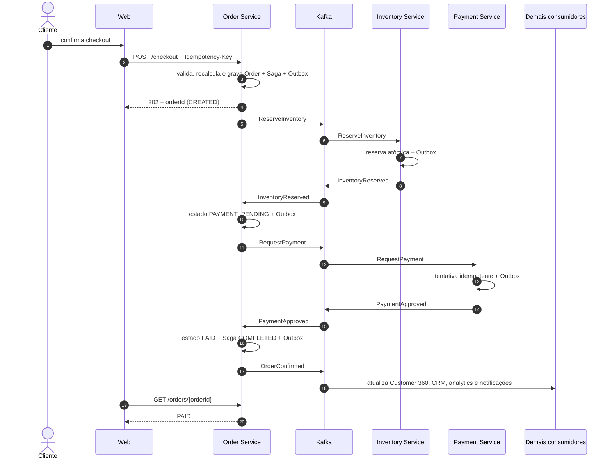
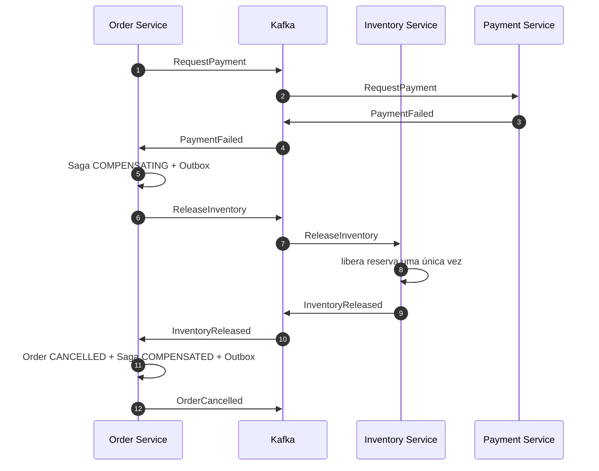
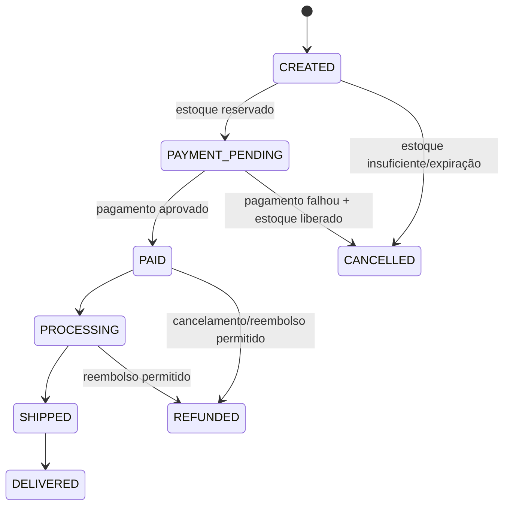

# Checkout e Saga

## Estratégia

O Order Service orquestra uma Saga baseada em mensagens. A escolha torna estado, deadlines e compensações explícitos, além de facilitar a demonstração de falhas. Não há transação distribuída nem chamada HTTP longa esperando estoque e pagamento.

## Fluxo de entrada

1. Cliente autenticado envia `POST /api/v1/checkout` com `Idempotency-Key`, carrinho e endereços selecionados.
2. Order Service valida ownership, estado do carrinho e formato.
3. Order consulta Catalog de forma síncrona para recalcular preços, promoções e cupom. O valor vindo do navegador nunca é confiável.
4. Em uma transação local, Order cria snapshots, pedido `CREATED`, registro `CheckoutSaga` e Outbox com `ReserveInventory`.
5. A API responde `202 Accepted` com `orderId`, estado e URL de acompanhamento.
6. O relay publica o comando e a Saga prossegue de forma assíncrona.

Se Catalog estiver indisponível antes do passo 4, nenhum pedido é criado e a API retorna erro transitório. Depois do commit, retries e compensações pertencem à Saga.

## Caminho de sucesso

## Falha de pagamento e compensação

Se a reserva falhar, Order cancela diretamente sem solicitar pagamento. Se um pagamento for aprovado após um timeout que já iniciou compensação, a reconciliação ordena reembolso idempotente antes de concluir o cancelamento.

## Estados

### Pedido

### Saga

`STARTED → RESERVING_INVENTORY → REQUESTING_PAYMENT → COMPLETED`

Rotas de falha usam `COMPENSATING → COMPENSATED`. Falhas operacionais repetidas usam `REQUIRES_ATTENTION`, geram alerta e preservam dados suficientes para retomada segura.

## Garantias e deadlines

- checkout repetido com a mesma chave e mesmo payload retorna o mesmo pedido;
- mesma chave com payload diferente retorna `409`;
- reserva e pagamento são únicos por pedido/operação;
- cada transição valida a versão atual da Saga;
- mensagens duplicadas não repetem movimentações;
- reserva possui expiração; um job publica o fato de expiração de forma idempotente;
- timeout não equivale automaticamente a falha definitiva de pagamento: o Payment Service reconcilia o estado da tentativa;
- DLQ não conclui nem cancela silenciosamente uma Saga; gera estado operacional visível.

## Dados observáveis

Order guarda timestamps de cada etapa, último evento, motivo de falha, tentativas e `correlationId`. Métricas medem duração ponta a ponta, taxa de compensação, Sagas paradas e divergências de reconciliação.
