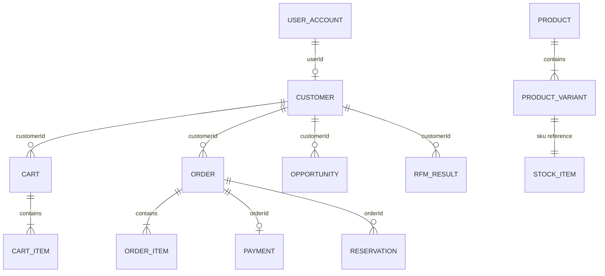

# Modelo de domínio inicial

O modelo abaixo define ownership e relações relevantes; não é um esquema físico definitivo. Agregados podem mudar por ADR conforme os casos de uso forem implementados.

## Auth

- **UserAccount:** `id`, `email`, `passwordHash`, `status`, `createdAt`, `lastLoginAt`.
- **Role / Permission:** autorização administrativa (`CUSTOMER`, `SELLER`, `MANAGER`, `ADMIN`).
- **RefreshSession:** hash do token, família, expiração, rotação, revogação e metadados do cliente.

## Customer

- **Customer:** identidade comercial ligada a `userId`, contato, nascimento, status e consentimentos.
- **Address:** endereço versionado do cliente; pedidos guardam snapshot próprio.
- **CustomerPreference:** preferências de comunicação e referências de produtos favoritos.
- **CustomerLabel:** classificação operacional como VIP, recorrente ou em risco.
- **CustomerMetrics:** total gasto, pedidos, ticket médio, última compra, score e versão da regra.
- **TimelineEntry:** projeção de eventos relevantes para o Customer 360.

## Catalog

- **Product:** nome, slug, descrição, status, categoria e mídias.
- **ProductVariant:** SKU, atributos, preço-base e preço promocional.
- **Category:** taxonomia navegável.
- **Promotion / Coupon:** elegibilidade, período, limite, regra e efeito de desconto.
- **Review:** nota, comentário, autor e moderação.

## Inventory

- **StockItem:** SKU, quantidade física, reservada, disponível derivado e mínimo.
- **Reservation:** pedido, SKU, quantidade, estado e expiração.
- **StockMovement:** razão, quantidade, referência, saldo anterior/posterior e ator.

Invariante: `physical >= 0`, `reserved >= 0` e `available = physical - reserved`. Reserva usa controle concorrente no banco e nunca pode tornar `available` negativo.

## Order

- **Cart:** cliente/sessão, itens, cupom, estado e expiração.
- **CartItem:** produto/SKU, quantidade e preço indicativo.
- **Order:** cliente, estado, totais, endereços em snapshot e IDs de correlação.
- **OrderItem:** descrição, SKU, quantidade, preço e desconto imutáveis.
- **CheckoutSaga:** etapa atual, comandos emitidos, resultados e compensações.

Invariantes: pedido confirmado exige reserva e pagamento aprovados; total é recalculado no servidor; transições de estado seguem máquina explícita.

## Payment

- **Payment:** pedido, valor, moeda, estado e cenário simulado.
- **PaymentAttempt:** chave idempotente, solicitação, resposta, erro e timestamps.
- **Refund:** valor, motivo, status e referência da tentativa.

## CRM

- **Lead:** origem, contato, estado e eventual `customerId`.
- **Opportunity:** pipeline, estágio, valor potencial, responsável, produto de interesse e motivo.
- **Pipeline / PipelineStage:** fluxo configurável e ordem dos estágios.
- **Interaction:** canal, resumo, data e ator.
- **Task:** responsável, vencimento, prioridade e estado.
- **Note:** conteúdo e autor.
- **OpportunityTag:** classificação local do CRM.
- **AdministrativeAuditEntry:** projeção sanitizada e imutável de mudanças administrativas.

## Notification

- **Notification:** destinatário, canal, template, payload permitido, status e tentativas.
- **NotificationPreference:** opt-in/opt-out por categoria e canal.
- **DeliveryAttempt:** resultado do envio interno ou e-mail simulado.

## Analytics

- **CustomerFeatureSnapshot:** recência, frequência, valor e features explicáveis por data de cálculo.
- **RfmResult:** scores R/F/M e segmento.
- **ChurnAssessment:** risco, classificação, razões, versão e limitações.
- **Recommendation:** produto origem, produto sugerido, score e evidência.
- **MetricAggregate:** métrica, dimensões, janela e valor.

## Relações entre contextos

As linhas entre contextos representam identificadores e contratos, não joins nem constraints entre databases.
