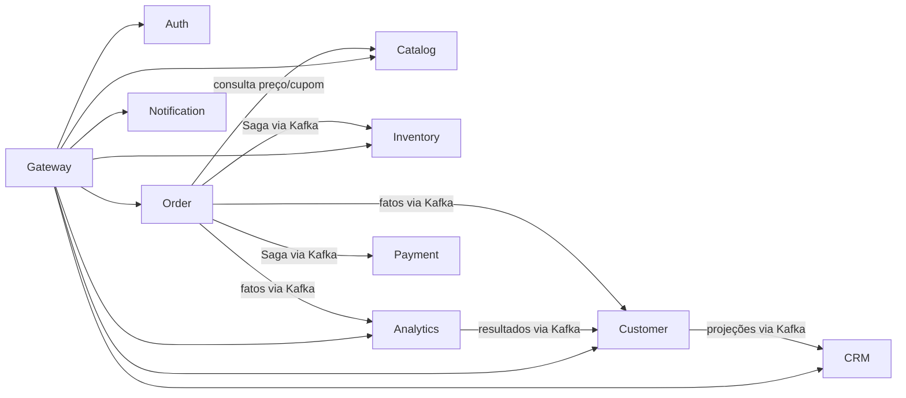

# Limites dos serviços

## Regras de boundary

- um serviço é a única autoridade de escrita sobre seus agregados;
- referências externas usam IDs estáveis e snapshots, nunca foreign keys entre bancos;
- integrações síncronas não participam de transações distribuídas;
- eventos publicados representam fatos concluídos; comandos representam pedidos que ainda podem falhar;
- modelos compartilhados limitam-se a contratos de protocolo.

## Responsabilidades

| Componente | É dono de | Não é dono de |
|---|---|---|
| **Gateway** | roteamento, CORS, rate limit, propagação de identidade e correlação | regras de negócio, dados de domínio ou emissão de tokens |
| **Auth Service** | usuário de acesso, credencial, role, permissão, refresh token e revogação | perfil comercial do cliente |
| **Customer Service** | perfil, endereços, preferências, favoritos, consentimentos, labels de cliente e projeção Customer 360 | credenciais, pedidos ou oportunidades CRM |
| **Catalog Service** | produto, SKU/variação, categoria, imagens, preço-base, promoções, cupons e avaliações | saldo físico ou reserva de estoque |
| **Inventory Service** | saldo físico/disponível/reservado, reserva, movimentação e política de estoque mínimo | preço, carrinho ou estado do pedido |
| **Order Service** | carrinho, itens, aplicação de preço/cupom, checkout, pedido e orquestração da Saga | autorização do pagamento ou saldo de estoque |
| **Payment Service** | tentativa de pagamento simulada, status, reembolso e idempotência do provedor | confirmação final do pedido |
| **CRM Service** | lead, oportunidade, pipeline, estágio, tarefa, nota, interação, follow-up e projeção consolidada de auditoria administrativa | perfil mestre do cliente ou pedidos |
| **Notification Service** | preferências de entrega, template, notificação interna, e-mail simulado e status de entrega | regras que originam eventos de negócio |
| **Analytics Service** | cálculo RFM, segmentação analítica, churn experimental, recomendação e métricas agregadas | perfil operacional mestre ou decisões transacionais |

## Decisões de sobreposição

### Carrinho e checkout

Ficam no Order Service porque compartilham cálculo, snapshots de item e a transição direta de carrinho para pedido. Um `cart-service` separado só será considerado se escala ou ciclo de mudança independente justificarem a extração.

### Customer Score e segmentação

O Analytics Service calcula modelos avançados e publica resultados explicáveis. O Customer Service valida a versão da regra e materializa o score/segmento operacional usado pelo Customer 360 e pelas automações. O histórico analítico permanece em Analytics.

### Tags

Customer Service possui labels de relacionamento do cliente, como `VIP` e `AT_RISK`. CRM Service possui tags aplicadas a leads e oportunidades. Os nomes podem coincidir, mas IDs e ciclos de vida não são compartilhados.

### Auditoria

Cada serviço registra alterações administrativas locais e publica um evento de auditoria sanitizado. O CRM Service mantém uma projeção somente-leitura para a tela administrativa consolidada. Valores secretos e credenciais nunca entram em `before` ou `after`.

### Cupons e preços

Catalog Service define promoções e cupons. Order Service consulta/valida a oferta e persiste um snapshot imutável do preço e desconto utilizados no pedido. Mudanças futuras no catálogo não reescrevem pedidos.

## Dependências permitidas

Chamadas adicionais precisam justificar latência, acoplamento e comportamento quando o destino está indisponível.
