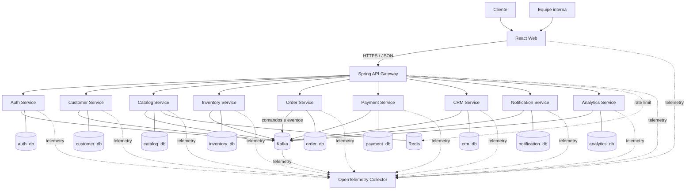

# Visão geral do sistema

## Objetivo

CommerceFlow combina uma loja virtual e um backoffice de CRM/analytics. O desenho separa contextos com regras e ciclos de mudança próprios, mantendo integrações explícitas por HTTP ou eventos.

## Visão de containers

## Estilos de comunicação

- **HTTP síncrono:** autenticação, consultas de tela, comandos que precisam de validação imediata e operações administrativas.
- **Kafka assíncrono:** mudanças de estado entre contextos, atualização de projeções, automações, notificações, analytics e Saga de checkout.
- **Banco por serviço:** nenhuma consulta direta ao schema de outro contexto. Dados externos necessários à leitura são copiados como snapshot ou projeção.
- **Redis:** somente cache de catálogo e rate limiting do gateway inicialmente; não é fonte de verdade.

## Consistência

Transações ACID terminam dentro de um serviço. Entre serviços, o sistema usa consistência eventual, Transactional Outbox e consumidores idempotentes. O usuário recebe um identificador de pedido e acompanha a evolução do checkout, em vez de manter uma transação HTTP aberta durante toda a Saga.

## Topologia local e evolução

No ambiente local, os bancos lógicos podem compartilhar uma instância PostgreSQL, mas possuem database, usuário e migrations separados. Isso preserva ownership sem pagar o custo operacional de múltiplos servidores. Em produção, qualquer banco poderá ser isolado sem alterar contratos.

Os serviços serão introduzidos nas fases em que exista um caso de uso vertical para exercitá-los. A arquitetura alvo não autoriza gerar todos os containers antecipadamente.
